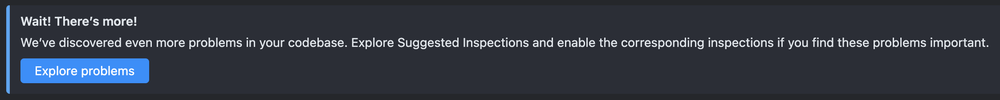
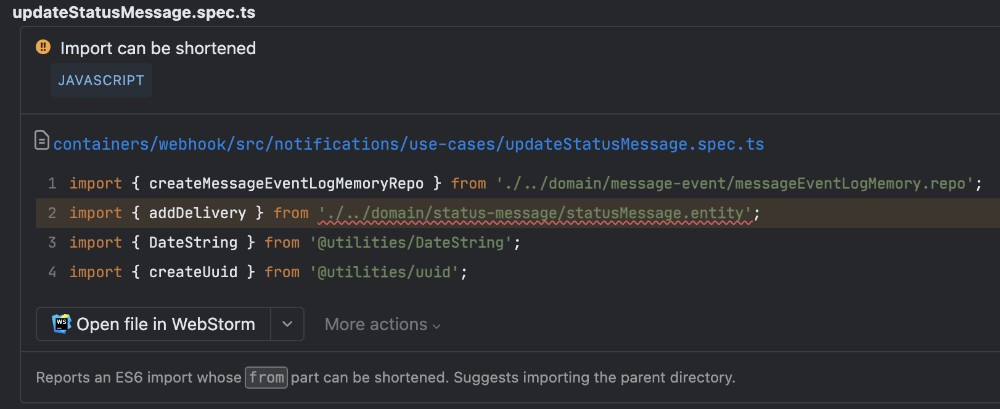

## Qodana

Qodana is a new code quality tool built by the folks over at JetBrains. They just [announced in July](https://blog.jetbrains.com/qodana/2023/07/qodana-is-out-of-preview-with-first-class-jetbrains-ide-integration/) that it is publicly available. I have a lot of respect for the JetBrains folks, so I've been spending some time trying it out.

## Pricing

The most compelling this about Qodana is the simple and relatively cheap pricing model. Their "ultimate" tier is $5 per active contributor a month. They have a free community edition, but that [doesn't support typescript or javascript](https://www.jetbrains.com/help/qodana/pricing.html) so it's not useful to me.

## Running Your First Scan

Because it's JetBrains we expect a pretty tight integration with their IDEs. It does seem that Qodana will probably shine the most for folks who are already using their suite of tools. It does seem like their preferred first experience is to run a "local" scan [right in your JetBrains IDE](https://www.jetbrains.com/help/qodana/quick-start.html#quickstart-run-in-ide).

I don't really use JetBrains IDEs, but they have a pretty easy to use [CLI tool](https://www.jetbrains.com/help/qodana/quick-start.html#quickstart-run-using-cli), so that's what I used.

When your scan is complete it starts a local webserver that hosts your results.

## Integration with CI (Github Actions)

I believe very strongly that any quality automation must be enforced by CI tooling. If you have some linting, formatting or other quality rules to enforce the ONLY way to enforce them is with CI tooling. Quality checks failing should break your build.

Qodana makes it pretty easy to do that. I use Github Actions, and integrating qodana scans into my checks was fairly easy all told. I did have a problem [getting data into their cloud platform](https://youtrack.jetbrains.com/issue/QD-6600/Project-still-waiting-for-data-after-successful-run-in-CI), but that's another story.

A major plus for Qodana is that it doesn't try and run your work load for you. I believe this is why their price can be so low. Similar tools like Snyk or SonarQube will hook into your PRs and run scans in their cloud, which I hate. Qodana does it right. You run qodana either directly with their CLI, or quite easily with some community plugin or action, right in your pipeline tool of choice.

## Adding Inspections



When you first configure Qodana it'll seem pretty bare bones. At first you'll pick a "linter" based on your project's language. In my case, I was using the `jetbrains/qodana-js:2023.2` linter. It will run eslint for you, and the bare linter includes some other decent quality inspections.



If you're just using the bare bones linter qodana will probably wind up showing you their "but wait there's more!" dialog. It turns out there are a lot of extra inspections available that are off by default. If qodana detects problems that those inspections would catch it'll recommend you turn them on.

Here's my current config with all the inspections I've opted into:

```yaml
version: "1.0"
linter: jetbrains/qodana-js:2023.2
include:
  - name: TrivialIfJS
  - name: DuplicatedCode
  - name: ParametersPerFunctionJS
  - name: FunctionWithMultipleLoopsJS
  - name: ThreeNegationsPerFunctionJS
  - name: FunctionWithMultipleReturnPointsJS
  - name: CyclomaticComplexityJS
  - name: StatementsPerFunctionJS
  - name: NestingDepthJS
  - name: UnnecessaryLocalVariableJS
  - name: TrivialConditionalJS
```

Importantly, you can also exclude code from these inspections. You can add a file to an excludes block in your qodana.yml, or for one off exclusions you can use their inline `noinspection` comment.

Excluding a path for a specific inspection:
```yaml
exclude:
  - name: JSUnusedLocalSymbols
    paths:
      - path/to/file.ts
```

Excluding a class from a specific inspection:
```ts
// noinspection JSUnusedLocalSymbols
export class Example {
    private constructor() {
        /* noop */
    }
}
```

## Progressive Improvement

Qodana has an important "baseline" feature. This will allow you to add qodana to your project today and cause it to fail your CI build without forcing you to fix every problem in your whole code base _today_. Once you've done your first scan you can mark all the problems Qodana finds as your "baseline".

With Qodana's baseline feature your build won't fail due to the known problems, but it _will_ fail if any new problems are added. Critically the baseline problems aren't _ignored_, they're just moved over into a baseline tab and you and your team can fix them incrementally. Do like 5 a week or something.

## My issues

I had some issues ranging from minor to major getting Qodana set up and running in my project(s). I filed them in the public Qodana youtrack so you can read them if you're interested.

You can judge for yourself how much was my fault versus theirs, but if you ask me I think there's missing documentation and UX that, if present, would have prevented me from getting hung up on this stuff for weeks.

- [Couldn't create my projects in qodana cloud when I first signed up](https://youtrack.jetbrains.com/issue/QD-6560/Error-creating-team-during-free-trial)
- [Dumb GHA config error that took me forever to solve](https://youtrack.jetbrains.com/issue/QD-6797/Qodana-failing-in-CI-on-simple-java-spring-project)
- [Misconfiguration prevented results from being uploaded to Qodana cloud.](https://youtrack.jetbrains.com/issue/QD-6600/Project-still-waiting-for-data-after-successful-run-in-CI) I still don't understand what I did wrong here. The fix was simple, but I don't know yet how I was supposed to know on my own to do it.
- [I don't like this error and I couldn't figure out how to suppress it.](https://youtrack.jetbrains.com/issue/QD-6768/It-is-not-a-problem-Unused-constructor-constructor)

## Conclusion

So far I quite like Qodana. I like the way it installs and integrates into a project, even though I wound up having a lot of trouble. I'm pretty willing to give them a pass on that considering it's so new, and the price really can't be beat.

Next steps for me and Qodana will be to trial it with one of our teams. I want to see if they find the checks useful, and I want to see if they can really chip away at the baseline problems. I'll follow up with a new post when I know the answers!
